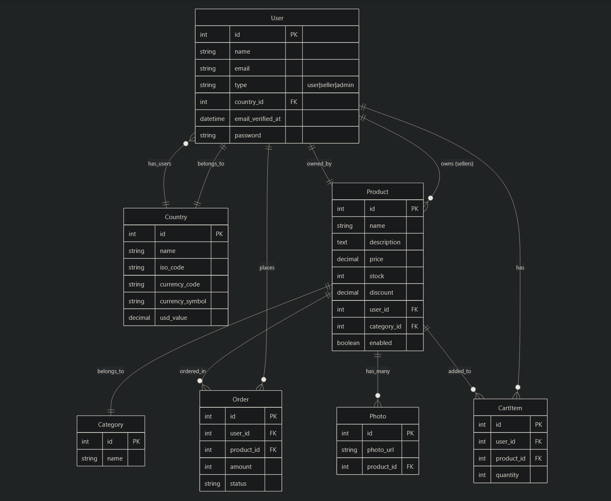
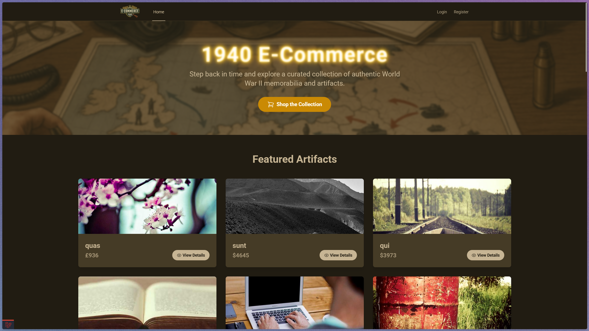
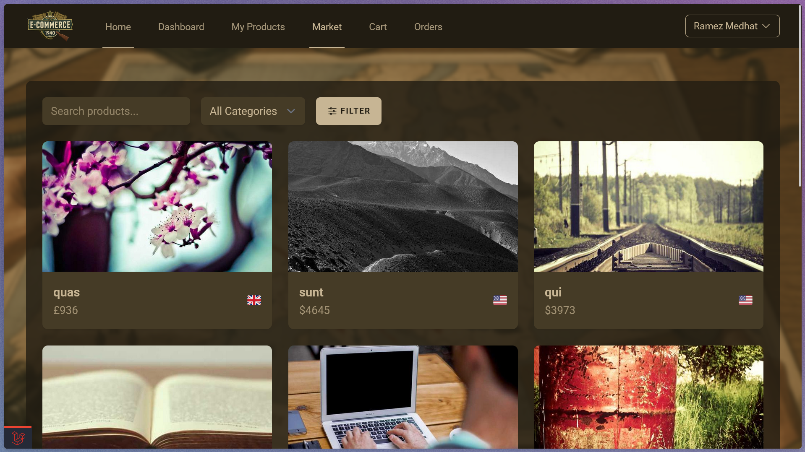
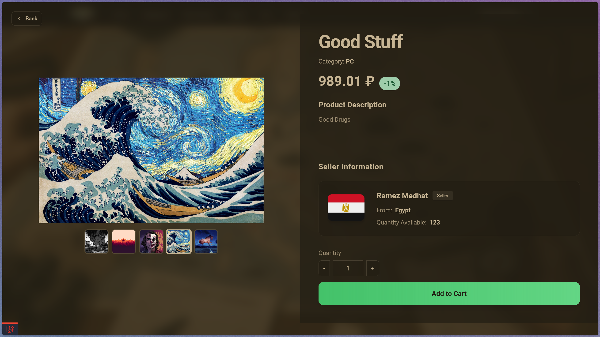
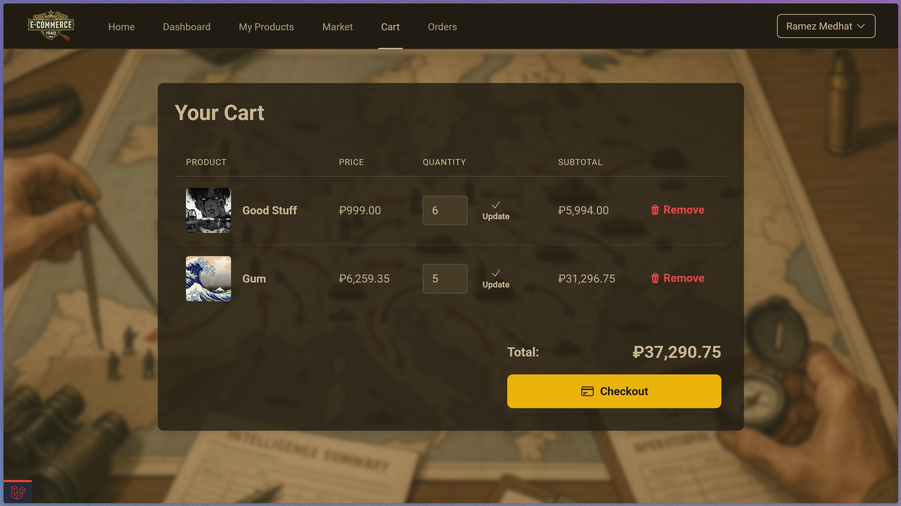
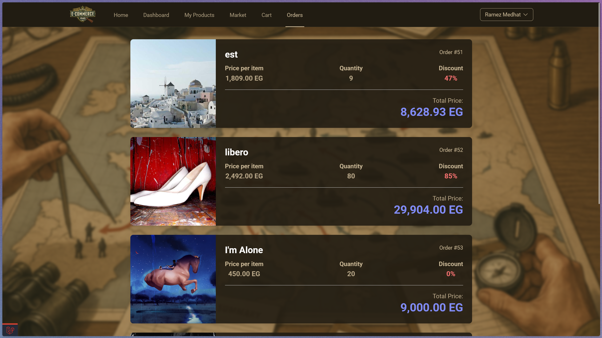
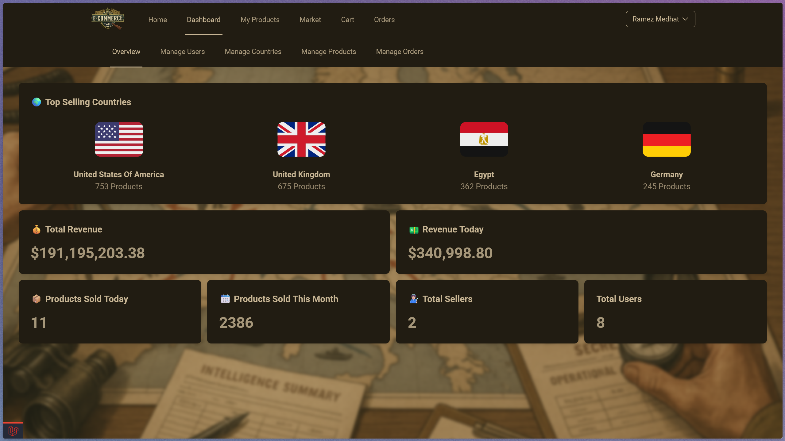
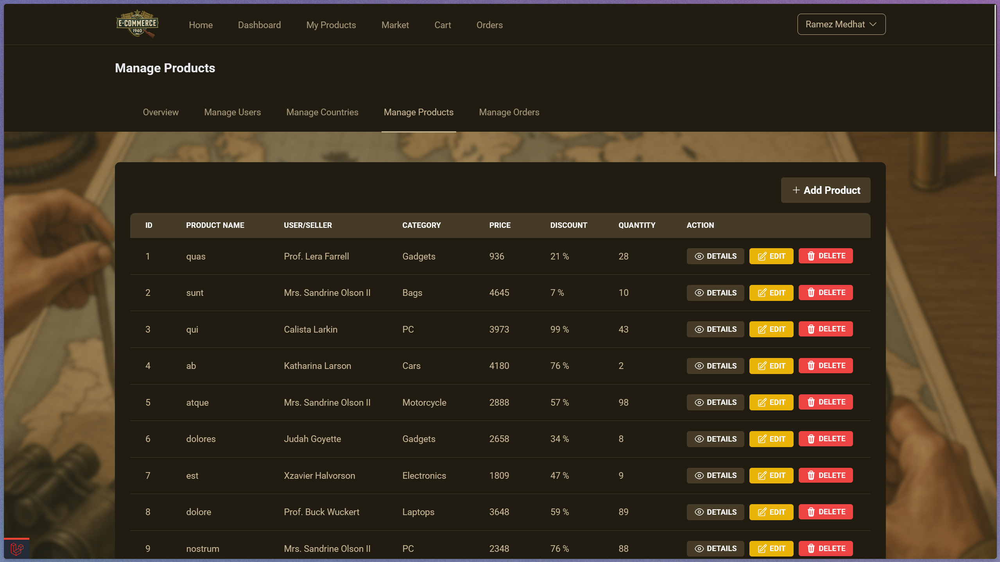
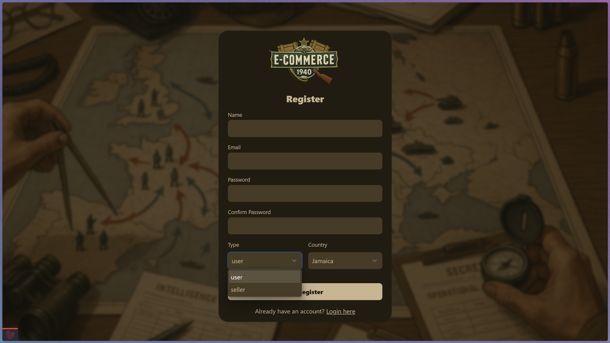
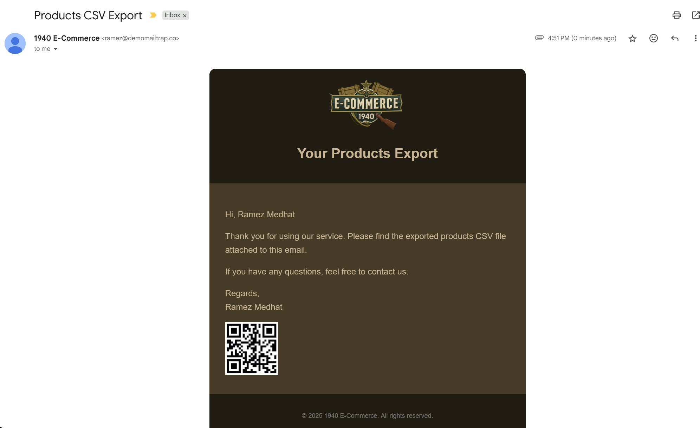

# 🛍️ E-Commerce Platform

A feature-rich, modern e-commerce platform built with the Laravel framework. This project provides a complete online shopping experience, from browsing products to completing orders, with additional features for sellers and administrators.

## ✨ Features

- **User Authentication:** Secure login and registration functionality.
- **Product Management:** Sellers can add, edit, and delete their products.
- **Product Catalog:** Browse products by category, with search and filtering capabilities.
- **Shopping Cart:** A fully functional shopping cart.
- **Order History:** Users can view their past orders.
- **CSV Export:** Export product data to a CSV file.
- **Email Notifications:** Sellers can send and recive emails with CSV file from other sellers.
- **QR Code Generation:** Generate QR codes for products or orders.
- **Admin Dashboard:** A comprehensive dashboard for administrators to manage users, products, and orders.
- **Admin Statistics:** View key statistics and metrics on the admin dashboard.


## 💻 Tech Stack
- **Backend:**
  - *Framework:* Laravel 12
  - *Database:* Postgres on Supabase 
  - *Styling:* Tailwind CSS
- **Packages:**
  - *Laravel Breeze:* for authentication
  - *Pint:* For linting
  - *endroid/qr-code:* for generating QR Codes


## 💾 Database Schema



- **`users`**: Stores user information, including their role (user, seller, admin) and country.
- **`products`**: Contains product details, such as name, price, and quantity.
- **`categories`**: A simple table for product categories.
- **`photos`**: Stores URLs for product images.
- **`countries`**: Holds country information, including currency details.
- **`orders`**: Records user orders.
- **`cartItems`**: Manages items in a user's shopping cart.

## 🛂 Middleware


- **`IsAuth`**: Restricts access to authenticated users only.
- **`IsAdmin`**: Restricts access to admin-only routes.
- **`IsSeller`**: Restricts access to routes for sellers and admins.


## 🗺️ Routing
The application's routes are organized into several files in the `routes/` directory:

- **`web.php`**: The main entry point for web routes, including the home page.
- **`auth.php`**: Handles all authentication-related routes, such as login, registration, and password reset.
- **`user.php`**: Defines routes for user-specific actions, including profile management, product browsing, and cart operations.
- **`seller.php`**: Contains routes for sellers, such as managing their products and exporting data.
- **`dashboard.php`**: Defines routes for the admin dashboard, which includes user, country, product, and order management.

## ⚙️ Controllers

The controllers in `app/Http/Controllers` handle the application's business logic:

- **`Auth/`**: Contains controllers for user authentication, provided by Laravel Breeze.
- **`CartItemController`**: Manages the user's shopping cart.
- **`CheckoutController`**: Handles the checkout process.
- **`CountryController`**: Manages countries in the admin dashboard.
- **`DashboardController`**: Provides data for the admin dashboard.
- **`HomeController`**: Displays the home page.
- **`OrdersController`**: Manages user orders.
- **`ProductController`**: Handles product-related actions for both users and admins.
- **`ProfileController`**: Manages user profiles.
- **`SellerController`**: Provides functionality for sellers, such as exporting product data.
- **`SellerProductController`**: Manages products for sellers.
- **`UserController`**: Manages users in the admin dashboard.

## 🖼️ Views
### Home Page:

### Market Page:

### Product Page:

### Cart Page:

### Orders Page:

### Dashboard Page:

### Products Dashboard Page:

### Register Page:

### Email:


## 🚀 Project Setup

1.  **Clone the repository:**
    ```bash
    git clone https://github.com/your-username/your-repository.git
    cd your-repository
    ```

2.  **Install dependencies:**
    ```bash
    composer install
    npm install
    ```

3.  **Environment Configuration:**
    Create a `.env` file by copying the example file:
    ```bash
    cp .env.example .env
    ```
    Then, generate the application key:
    ```bash
    php artisan key:generate
    ```

4.  **Run Migrations:**
    ```bash
    php artisan migrate
    ```

5.  **Serve the application:**
    In two separate terminals, run the following commands:
    ```bash
    npm run dev
    ```
    ```bash
    php artisan serve
    ```
    The application will be available at `http://127.0.0.1:8000`.
